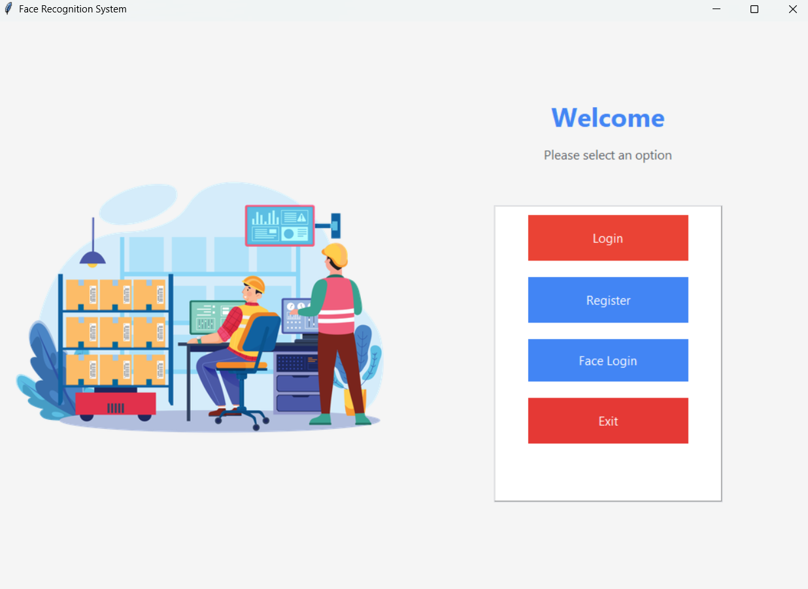
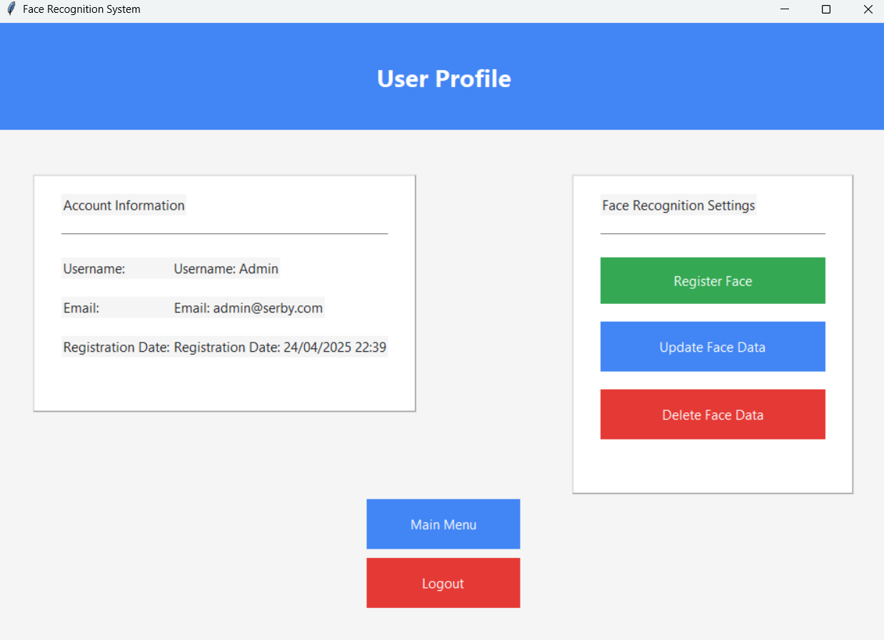

# Face Recognition Login System 🧑‍💻🧠

This project offers a modern authentication interface using face recognition technology in addition to the traditional username/password login system. Users can create accounts, register their faces in the system, and log in only with face recognition. It was developed with security, user experience, and modern user interface in mind.

## 🚀 Features

- 👤 **User Registration:** Account creation with email verification
- 🔐 **Encrypted Login:** User logins with secure encryption (bcrypt)
- 📷 **Face Recognition Login:** Real-time face recognition using OpenCV
- 🧠 **Model Training:** Model training and updating with user faces
- 🔄 **Password Reset:** Password renewal with email verification
- 🎨 **Modern Interface:** User-friendly, simple and modern interface developed with Tkinter
- 🧼 **Face Data Management:** Update and delete registered face data

## 📸 Face Recognition Technology

- Face detection using Haar Cascade with **OpenCV**
- Trained face recognition model with **LBPHFaceRecognizer**
- Identity verification with real-time video streaming

## Technologies Used

- Python 3.x
- OpenCV (for face recognition)
- Tkinter (for interface)
- bcrypt (for encryption)
- cryptography (for data security)
- PIL (for visual operations)

## Proje Yapısı
.face_recognition_system
├── app/
│   ├── __init__.py   
│   ├── face_register.py 
│   ├── repository.py         
│   ├── ui.py
|   ├── illustration.png
|   └── __pycache__
|
├── data/
|   ├── trainer.yml
|   ├── users.json
|   └── ....jpg
|
├── secrets/
|    ├── secret.key
|
├── .gitignore
├── main.py
├── requirements.txt
├── README.md

## 📦 Kurulum ve Kullanım

1. Clone this repo:
   ```bash
   git clone https://github.com/serhatbozoglu/face_recognition_system.git
   cd face_recognition_system

2. Install required dependencies:
    ```bash
    pip install -r requirements.txt

3. Start the app:
    python main.py or py main.py



4. When you install the application, you will notice that the project structure you see above is not complete. The secrets/secret.key, data/users.json files in the application will be automatically created in the data/ and secrets/ folders after you run the application and complete the first registration process.

5. During the registration process, you need to enter the verification code that appears on the terminal of your code editor on the screen that appears. Then, you will be directed to the login screen and log in with your user information.

6. When you click on the register face button during the login process, your camera will open and recognize your face. After your face recognition process is completed, it will be added as user.1.0.jpg - user.1.69.jpg in the data/ folder and the model that recognizes your face will be trained with this data and a trainer.yml file will be created in the data/ folder.



7. Finally, you will now be able to easily log in to the application with the face login button.
